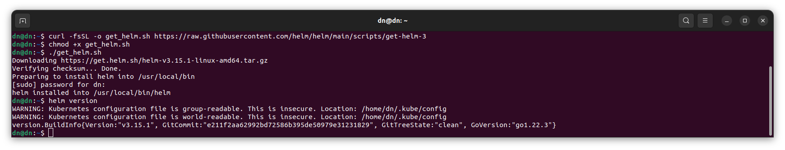
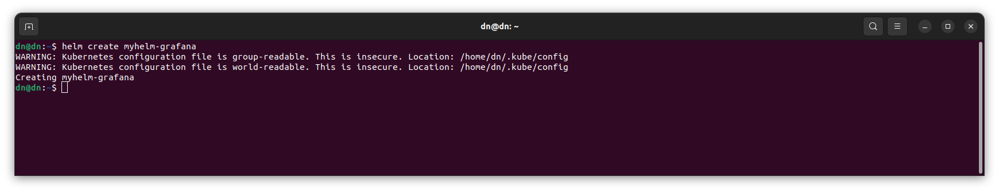
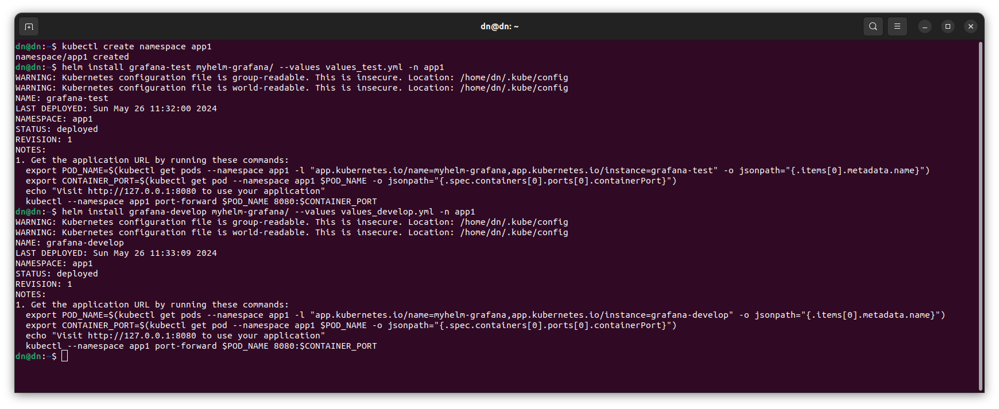
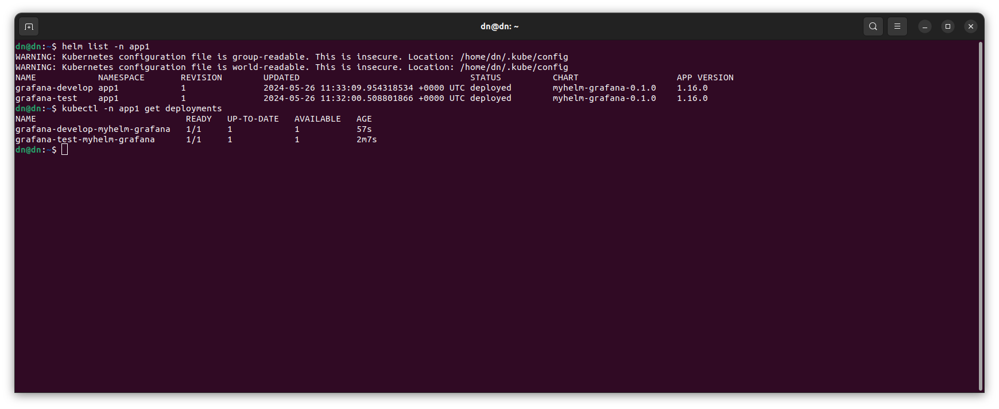
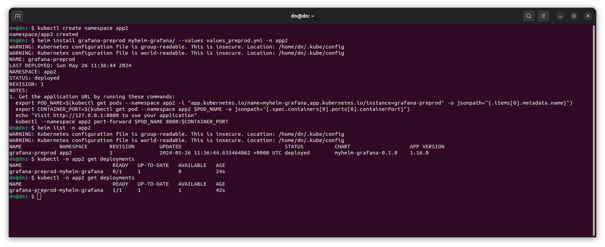
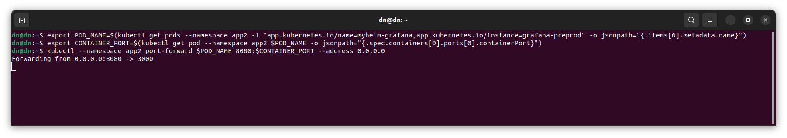
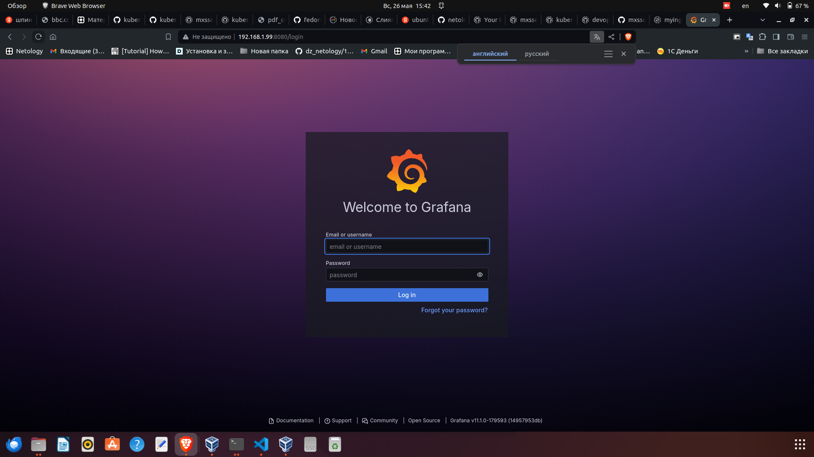

# Никоноров Денис - FOPS-8
# Домашнее задание к занятию «Helm»

### Задание 1. Подготовить Helm-чарт для приложения

1. Необходимо упаковать приложение в чарт для деплоя в разные окружения. 
2. Каждый компонент приложения деплоится отдельным deployment’ом или statefulset’ом.
3. В переменных чарта измените образ приложения для изменения версии.

------
### Задание 2. Запустить две версии в разных неймспейсах

1. Подготовив чарт, необходимо его проверить. Запуститe несколько копий приложения.
2. Одну версию в namespace=app1, вторую версию в том же неймспейсе, третью версию в namespace=app2.
3. Продемонстрируйте результат.

### Решение задания 1. Подготовить Helm-чарт для приложения

Установлен на ноуд Helm использован скрипт

Создан собственный helm chart с именем `myhelm-grafana`

Создано два файла Values [values_develop](/values_develop.yml) и [values_test](/values_test.yml) дл DEVELOP и TEST окружения.
Дописаны в них необходимыем параметры для запуска Grafana, такие как имя образа, тег, порт.

### Решение задания 2. Запустить две версии в разных неймспейсах

Создан новый Namespace app1 и произведу запуск приложения в этом Namespace.

Проверка результата

Видно что развернуты с помощью Helm в виде отдельных Deployments.

Разверну еще версию приложения, но в Namespace app2.

Приложение работает.

М/у собой приложения отлачаются версиями образов, в указаных тегах.

Для проверки Grafana проброшен порт и проверю, откроется web-интерфейс приложения:

Все работает и видно при входе версию Grafana v11.1.0-179593 (14957953db).